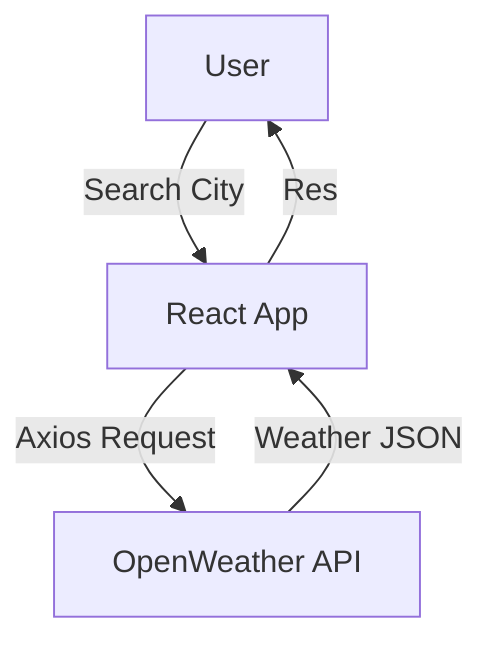

# ⛅ Weather Vibes  

A modern, responsive **Weather Application** built with **React (Vite)**, styled using **TailwindCSS**, and animated with **Framer Motion**.  
It fetches real-time weather data from the **OpenWeather API** and delivers a smooth user experience with a background video and interactive design.  

🔗 **Live Demo**: [Weather Vibes](https://weather-vibes-eight.vercel.app/)  

---

## 🚀 Features  

- 🌍 **Search weather by city name**  
- 🎥 **Background video** for immersive UI  
- 📱 **Fully responsive** design for all devices  
- ✨ **Framer Motion animations** for smooth transitions  
- 🎨 **Modern UI with TailwindCSS**  
- ☁️ **weather data** (temperature, description, weather icons)  
- 🔄 **Error handling ** for better UX  

---

## 🛠️ Tech Stack  

- **Frontend**: React + Vite  
- **Styling**: TailwindCSS  
- **Animations**: Framer Motion
- **Data Fetching**: Axios  
- **API**: OpenWeather API  

---

## 📸 Screenshots  


## 🏗️ System Architecture



# 📂 Project Structure
```
└── 📁my-weather-app
    └── 📁public
        ├── logo.png
    └── 📁src
        └── 📁assets
            └── 📁backgroundVedio
                ├── 857027-hd-1920-1080-30fps_LtrfwlD6.mp4
            └── 📁weatherIcon
                ├── weatherIconSuper_clean.webm
        ├── App.jsx
        ├── index.css
        ├── main.jsx
    ├── .env
    ├── .gitignore
    ├── eslint.config.js
    ├── index.html
    ├── package-lock.json
    ├── package.json
    ├── README.md
    └── vite.config.js
```
---------------------------------
# ⚙️ Installation & Setup
### Clone repo
git clone https://github.com/your-username/weather-vibes.git

### Navigate into project
cd weather-vibes

### Install dependencies
npm install

### Add environment variables
### .env file
- VITE_WEATHER_API_KEY=your_api_key_here
- VITE_WEATHER_BASE_URL=https://api.openweathermap.org/data/2.5/weather

### Start dev server
npm run dev

----------------------------------- 
# 📦 Build for Production
- npm run build


# Built with ❤️ by Ali Mahmoud.

Black wolf
